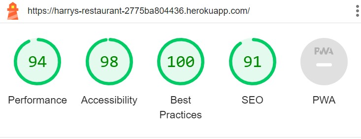

# Harry's Restaurant
Harry's Restaurant is a full-stack, responsive website built for a fictional Restaurant for educational purposes only.

It allows the user to create an account so they can make a booking at table at the restaurant. Users can also browse the menu, letting them veiw the delicious dishes that are on offer.


## Agile Methodology
The plan for this project was carried out using Agile Methodology. GitHub Issues were used to record the User Stories. These were made up of all the key functionality that a user would expect from a Restaurant website.

Each Each User Story contains Acceptance Criteria and Tasks which I sometimes had to adjust during the process, as I wasn't yet sure what was required to achieve the Acceptance Criteria.

To aid with prioritisation, I used The MoSCoW Method, which consisted of classifying each User Story as a 'Must Have', 'Should Have' or 'Could Have'. Some 'Could Have's didn't make it into the project and were left in the Backlog for a future iteration. It is important to note here, that by writing only enough User Stories to reach the Minimum Viable Product(MVP), 'Won't Have' was not included currently as a category.

To summarise, I found using the Agile Methodology of great benefit as it helped me to better organise, prioritise and plan the development of my project. Although I didn't give myself a specific duration for each iteration, it greatly helped my time management. I also felt sense of achievement, ticking off the Tasks while working on a User Story and placing it in the 'Done' column when it was completed.

## User Experience

### Strategy / Site Objectives
Harry's Restaurant aims to create an inviting and welcoming impression that makes it easy for people and their families and friends to enjoy a quality meal together.

It provides a simple way for people to book a table and organise a nice get-together for a special occasion.

The target audience aimed towards people aged 18 years+, however anyone is welcome to Harry's Restaurant.

### Scope / User Stories

* **First Time Visitor Goals**
    * As a first time user, I want to be about to sign up to an account to have access to other features such as making a booking.
    * As a first time user, I want to be able to view the menu so that I can so what food is available.
            
* **Returning Visitor Goals**            
    * As a returning visitor, I would like to see if there are any changes to the menu.
    * As a returning visitor, I would like to know what if there are any changes to the opening times.
    * As a returning visitor, I would like to know any updates on the contact details.
    * As a returning Visitor, I would like to be able to find links to the social media pages of the restaurant.

* **Authenticated User Goals**
    * As an authenticated user, I want to be able to book a table at the restaurant to reserve a space.
    * As an authenticated user, I want to be able to make changes to my reservation such as the date or the time or number of people attending.
    * As an authenticated, user I want to be able to view all of the bookings that I have made to easily manage them
    * As an authenticated user, I would like to be able to cancel any bookings that I have made.

### Structure / Designs Choices

The website is simple to use and consistent within its structure. The website was designed to be responsive on screens from 375px and above, making it great ti use from mobile to desktop.

For desktop users the navigation bar shows the 'Harry's Restaurant' logo and links to pages for 'Home', 'Bookings', 'Menu' and 'Logout' (for authenticated users) or 'Sign up' and 'Login' pages (for unauthenticated users). For users on a screen size of 767px or below the navigation bar will collapse down and be accessible via a burger button to save screen space and a more polished appearance. The navigation bar is repeated across all pages on the site, allowing for easy navigation.

The Footer displays social media links which open in a separate tab for ease of use. It also displays the restaurants's address, the opening hours and other contact details. The footer is also repeated across all pages to keep the design uniform and for ease of access.

The Home Page clearly indicates the purpose of the site with a jumbotron which will urge users to sign up (for unauthenticated users) or book a table (for authenticated users). Below is a description of the restaurant which describes the style of cuisine on offer and an 'Our Story' section, which gives insight to the orgins of the restaurant and its mission.

The Bookings page allow users to easily see all of there bookings that have been made and clearly display the details of the booking. Users can also edit and cancel any of their bookings as well as add a new booking from this page. Users can also click the booking number of any booking to see the details of that particular booking.

The Menu page clearly shows the user what food the restaurant has on offer. the dishes are broken down in categories of Starters, Mains and Deserts.

The Sign up / Login pages are clear and and display the fields in a familiar format to the user.

#### Database Schema

One custom model has been implemented for this project: Reservation.


### Skeleton / Wireframes

Using wireframes greatly aided the planning process and allowed me to have a clear direction I want the structure of the project to go. I only completed wireframes for the Home and Booking pages as these were the only pages, that I felt, that need attention to their structure. The other pages are very basic and did not need much planning if any at all.

[Click here to view the home page wireframe](readme_images/harrys_restaurant_home_wf.pdf)

[Click here to view the bookings page wireframe](readme_images/harrys_restaurant_bookings_wf.pdf)

> [!NOTE]
> Wireframes are not coming out quite as planned but the primary structure is still visible.

### Surface

#### Colour Scheme

The colour scheme that I used was very monochromatic, with splashes of colour for items of interest such as buttons or links.

The primary background colour is White with black text for easy readablility. The jumbotron used on the home page is a contrast to this colour scheme, which has a black background and white text, to indicate the start and end of a new section.

#### Typography

The two fonts I used for this project were EB Garamond and Roboto. EB Garamond was used for the main headings of the site and Roboto was used for the main body of text. EB Garamond is a serif based font while Roboto is a sans-serif which enabled them to offer a good contrast and compliment eachother well while still being easily readable.

#### Icons

Icons were used to display the social media icons in the footer as I found it an easy and intuitive was of displaying the links to the user. Aria-labels are used on the links to help assist screen readers.

## Feautures

### Existing Features

#### Header & Navigation

The header and navigation are displayed across all pages and includes a link on the Logo which brings the user to the home page. For medium screen sizes and below a hamburger button appears, which expands to show the navigation list with links to the Home, Bookings, Menu, Register and Login pages. This helps reduce the clutter on the header by keeping the page links neatly stowed away until the user clicks the hamburger button.

Links to the Home, Bookings, Menu, Register and Login pages on desktop, are displayed openly across the header, which help the user to navigate easily from page to page, without having to revert back to the previous page via the back button. 

When a user is authenticated the Register and Login links will be replaced with a Logout link.


#### Footer

The footer, which is displayed across all pages and is fully responsive, includes the opening times of the restaurant, links to social media pages, the address of the restaurant and other major contact details.

The social media links utilize the hover CSS pseudo-class which gives a good visual indication to the user that they are hovering over a link.


#### Home Page Jumbotron

The Home Page jumbotron is big and bold, enabling it to catch the users attention. This is a dynamic feature that will promt the user to sign up and register if they are not authenticated or alternatively, it will promt the user to make a booking if they are authenticated.


#### Home page content

The rest of the content on the home page tells the user a little bit about the restaurant such as its origin story, what it values and the mission as a restaurant.


#### Bookings Page

The Bookings page is a place where user can go to for anything related to the bookings. The can add, edit, cancel and view their current bookings.

Booking details are listed in date order and display all of the key details of the bookings.

This page requires the user to be authenticated should they try and access the page via the URL directly.


#### Booking Details Page

The Booking Details page is a page that will display the booking details of a specific booking. It is access by clicking the booking number of a booking on the Bookings page.

This page requires the user to be authenticated should they try and access the page via the URL directly.


#### Add Booking Page

This page generates a form based from the Reservation model that the user can fill in to create a booking. The form is validated and the user cannot submit out the form if it is incomplete.

This page requires the user to be authenticated should they try and access the page via the URL directly.


#### Edit Booking Page

This page generates a form automatically filled with the details of the booking that is being edited. The form is based from the Reservation model and has all of the required field to input the data correctly

This page requires the user to be authenticated should they try and access the page via the URL directly.


#### Cancel Booking Page

If the user wish to cancel a booking, they are asked to confirm the cancelation. The page displays the booking details of the booking that the user wishes to cancel so they can be sure they are canceling the corrrect booking.

This page requires the user to be authenticated should they try and access the page via the URL directly.


#### The Menu Page

This page display all of the dishes the restaurant has to offer in a clear and easy to read format that makes it easy for the user to make their choice.


#### Registration Page

This is the page that a user will come to if they wish to create an account. The form template is generated using [django-allauth](https://django-allauth.readthedocs.io/en/latest/) and it is comprised of the following fields:
* Username
* Email
* Password
* Password (again)

The addition of the second password field ensures that the user does not make a mistake in setting up their account.

If the user already has an account, they can login in using the link that will take them to the login page


#### Login Page

This is the page that a user will come to if they wish to create an account. The form template is generated using [django-allauth](https://django-allauth.readthedocs.io/en/latest/) and it is comprised of the following fields:
* Username
* Password

If the user has not created an account they can sign up using the link that will take them to the registration page.


#### Logout page

Users can easily logout via the logout page. Users are asked if they are sure they wish to logout and once confirmed, the user is logged out and directed to the home page.

The form template is generated using [django-allauth](https://django-allauth.readthedocs.io/en/latest/).


### Future Features

* I look to implement a Google Map API and assign it to the restaurants location so that users can see the location on a map.

* I would like to notify the user when they login our logout with an alert so they are confirmed of the change in authentication.

## Technologies Used

### Languages
* [HTML5](https://en.wikipedia.org/wiki/HTML5)
* [CSS3](https://en.wikipedia.org/wiki/CSS)
* [Python](https://en.wikipedia.org/wiki/Python_(programming_language))

### Libraries and Frameworks
* [Django 3.2.20](https://docs.djangoproject.com/en/4.2/releases/3.2.20/) - Free and open source Python Web Framework
* [Gunicorn 21.2.0](https://docs.gunicorn.org/en/stable/) - A Python WSGI HTTP server compatible with Django and used to run the project on Heroku
* [PostregSQL 0.5.0](https://www.postgresql.org/) - A powerful, open-source object-relational database system
* [Psycopg 2.9.6](https://www.psycopg.org/docs/) - A PostgreSQL database adapter for Python
* [Cloudinary 1.33.0](https://cloudinary.com/) - A persistent file store for media
* [Heroku](https://dashboard.heroku.com/) - A cloud platform used to deploy the project
* [ElephantSQL](https://www.elephantsql.com/) - PostgreSQL database hosting service
SQLite3 - The database provided by Django
* [Django-allauth](https://django-allauth.readthedocs.io/en/latest/) - - Integrated set of Django applications used for authentication and registration
* [Bootstrap 5.2.3](https://getbootstrap.com/docs/5.2/getting-started/introduction/) - A Framework for building responsive, mobile-fist sites

### Tools
* [Gitpod](https://www.gitpod.io/) - Used as a cloud based IDE
* [Github](https://github.com/) - Used as an Agile development tool and version control
* [Git](https://git-scm.com/) - Git was used for version control by using the Gitpod terminal to regularly commit to Git and push to Github.
* [W3S Markup Validator](https://validator.w3.org/#validate_by_input) - The W3S Markup Validator was used to ensure the HTML code was free of any syntax errors.
* [W3S CSS Validator](https://jigsaw.w3.org/css-validator/#validate_by_input) - The W3S CSS Validator was used to ensure the CSS code was free of any syntax errors.
* [Figma](https://www.figma.com/) - Figma was used in the design process to create wireframes for the project. This made it easy to visualize the layout of the website.
* [Lucidchart](https://lucid.app/) - Lucidchart was used to create the Entity Relationship Diagram.
* [Google Fonts](https://fonts.google.com/) - Google fonts was used to to import the EB Garamond and Roboto fonts used throughout the website.
* [Hover.css](https://ianlunn.github.io/Hover/) - Hover.css was used on the social meadia icons in the  footer. 

## Testing

### Header and Navbar
* Logo link
    * Link works as expected and takes the user back to the home page.
* Booking page link
    * For unauthenticated users the link works as expected and takes the user to the login page to prompt the user to login in because authenticaton is required to make a booking.
    * For authenticated users the link works as expected and takes the user to the bookings page.
* Menu page link
    * The link to the menu page works as expected and takes the user to the menu page.
* Sign up page link
    * The link to the sign up page works as expected and takes the user to the sign up page.
* Login page link
    * The link to the login page works as expected and takes the user to the login page.
* Logout page link
    * The link to the logout page works as expected and takes the user to the logout page.

### Footer
* Facebook social media link
    * Link works as expected and takes the user to www.facebook.com
    * Color changes to orange when hovered over due to the css hover attribute, as expected.
* Instagram social media link
    * Link works as expected and takes the user to www.instagram.com
    * Color changes to orange when hovered over due to the css hover attribute, as expected.
* Youtube social media link
    * Link works as expected and takes the user to www.youtube.com
    * Color changes to orange when hovered over due to the css hover attribute, as expected.


### Home Page
* Sign up link in jumbotron (for unauthenticated users)
    * Link works as expected and takes the user to the sign up page.
* Sign up link in jumbotron (for authenticated users)
    * Link works as expected and takes the user to the bookings page.

### Bookings Page
* Add booking button
    * Button works as expected and takes the user to the Add Booking Form.
* Booking number link
    * The link works as expected and takes the user to the booking details page for the particular booking that has been selected.
* Edit booking button
    * Button works as expected and takes the user to the Edit Bookings Form for the particular bppking that has been selected.
* Cancel bookings button
    * Button works as expected and takes the user to the Cancel Bookings Page for the particular booking that has been selected.
* Other tests
    * Page successfully loads list of bookings that have been created by the authenticated user only.
    * Page successfully displays the booking details for each booking.

### Add Booking Form
* Form Validation
    * Cannot submit form with empty first name field.
    * Cannot submit form with empty last name name field.
    * Cannot submit form with empty email field.
    * Cannot submit form without entering a valid email address.
    * Cannot submit form with empty date field.
    * Cannot submit form with empty time field.
    * Cannot submit form with the number of people field being less than 1.
    * Cannot submit form with a date selected that is before the current date.
    * Can submit form with an empty special requests field.

### Edit Booking Form
* Form Validation
    * Cannot submit form with empty first name field.
    * Cannot submit form with empty last name name field.
    * Cannot submit form with empty email field.
    * Cannot submit form without entering a valid email address.
    * Cannot submit form with empty date field.
    * Cannot submit form with empty time field.
    * Cannot submit form with the number of people field being less than 1.
    * Cannot submit form with a date selected that is before the current date.
    * Can submit form with an empty special requests field.

### Cancel Booking page
* Confirm button
    * Clicking the confirm button successfully deletes the selected booking.
* Other tests
    * Page successfully displays the booking details for the selected booking to the user.

### Sign up Form
* Form Validation
    * Cannot create a user with a username already registered.
    * Cannot create a user with an email address already registered.
    * Can create a user without the email field populated, which is expected because it is optional.
    * Cannot create a user without both password fields matching.

### Login Form
* Form Validation
    * Cannot login with a registered and matching username and password.

### Logout Page
* Logout Button
    * As expected, the user is successfully signed out when they click the sign out button.

### Further Testing

#### Google Chrome DevTools Lighthouse
I run the project twice through Lighthouse in Google Chrome DevTools; once in mobile and the other in desktop. Below are the results.
* Lighthouse - Mobile:


* Lighthouse - Desktop:


#### Cross Platform testing
* The website was tested on Google Chrome, Mozilla Firefox, Microsoft Edge and Safar browsers.
* The website has been tested on multiple devices with various viewport widths including a desktop, a laptop and an iPhone 14.

## Bugs

<details>
<summary>First Deployement Bug</summary>

During my first deployment my project deployed from Heroku unsuccessfully. I found that I made a typo in the `DISABLE_COLLECTSTATIC` config var.

I solved this by correcting the typo and corrently deploying the project.
</details>

<details>
<summary>Bookings List Bug</summary>

I had an issue where an authenticated user would see all of the booking every created and not just the ones created by them. I looked up various pieces of django documentation, icluding topics on the `get_queryset()` method and ListViews.

I solved the issue by adding the follow method to the ReservationListView.
```
def get_queryset(self):
        return Reservation.objects.filter(booking_creator=self.request.user)
```
## Remainging Bugs
<details>
<summary>Phone Field Validation</summary>

The phone field currently accepts letters.
</details>
## Deployment

For good practice, this project was deployed early to Heroku in order to save time and avoid inconveniences later on.

After installing Django and the supporting libraries, the basic Django project was created and migrated to the database.

The database provided by Django db.sqlite3 is only accessible within the workspace environment. In order for Heroku to be able to access the database, a new database suitable for production needs to be created. I am using a postgreSQL database instance hosted on ElephantSQL as this service is free.

<details>
<summary>Steps taken before deploying the project to Heroku</summary>

### Create the Heroku App

1. Login to Heroku and click on the top right button ‘New’ on the dashboard. 
2. Click ‘Create new app’.
3. Give your app a unique name and select the region closest to you. 
4. Click on the ‘Create app’ button.

### Create the PostgreSQL Database

1. Login to ElephantSQL and click on the top right button ‘Create New Instance’.
2. Give your plan the name of the project and select the Tiny Turtle (Free) plan.  The ‘Tags’ field can be left empty.  
3. Click on ‘Select Region’ and select a data centre near you and click ‘Review’.  
4. Make sure your plan is correct and click ‘Create Instance’. 
5. Return to the dashboard and click on this project’s instance you just created. This will open up the “Details” page where the link to the URL is displayed.  This needs to be added to the env.py file in the project’s directories.

### Create the env.py file

With the database created, it now needs to be connected with the project.  Certain variables need to be kept private and should not be published to GitHub.  

1. In order to keep these variables hidden, it is important to create an env.py file and add it to .gitignore.  
2. At the top **import os** and set the DATABASE_URL variable using the `os.environ` method. Add the URL copied from instance created above to it, like so:
`os.environ[“DATABASE_URL”] = ”copiedURL”`
3. The Django application requires a SECRET_KEY to encrypt session cookies.  Set this variable to any string you like or generate a secret key on this [MiniWebTool](https://miniwebtool.com/django-secret-key-generator/).
`os.environ[“SECRET_KEY”] = ”longSecretString”`

### Modify settings.py 

It is important to make the Django project aware of the env.py file and to connect the workspace to the new database. 

1. Open up the settings.py file and add the following code. The if statement acts as a safety net for the application in case it is run without the env.py file.
```
import os
import dj_database_url

if os.path.isfile(‘env.py’):
    import env
```
2. Remove the insecure secret key provided by Django and reference the variable set in the env.py file earlier, like so:
```
SECRET_KEY = os.environ.get(‘SECRET_KEY’)
```
3. You can leave DEBUG as True or set it to `'DEVELOPMENT' in os.environ` and then add the following to the env.py file:
```
os.environ["DEVELOPMENT"] = "True"
```
4. Hook up the database using the dj_database_url import added above.
```
DATABASES = {
    'default': dj_database_url.parse(os.environ.get('DATABASE_URL'))
}
```
5. Save and migrate this database structure to the newly connected postgreSQL database.  Run the migrate command in your terminal
`python3 manage.py migrate`

6. To make sure the application is now connected to the remote database hosted on ElephantSQL, head over to your ElephantSQL dashboard and select the newly created database instance. Select the ‘Browser’ tab on the left and click on ‘Table queries’.  This displays a dropdown field with the database structure which has been populated from the Django migrations.
### Connect the Database to Heroku

1. Open up the Heroku dashboard, select the project’s app and click on the ‘Settings’ tab.
2. Click on ‘Reveal Config Vars’ and add the DATABASE_URL with the value of the copied URL from the database instance created on ElephantSQL.
3. Also add the SECRET_KEY with the value of the secret key added to the env.py file. 
4. If using gitpod another key needs to be added in order for the deployment to succeed.  This is PORT with the value of 8000.

### Cloudinary Setup

1. Go to your [Cloudinary](https://cloudinary.com) account's dashboard and click on the ‘API environment variable’ to copy to clipboard.  This is used to connect your app to your Cloudinary account.  Add this to the env.py file in your workspace using CLOUDINARY_URL as the variable name.  Remember to remove the first part of the URL (CLOUDINARY_URL=) as this will give you a failed deployment.  
2. Copy and paste this value into the Heroku config vars with the key CLOUDINARY_URL.
3. In Heroku add one more temporary variable to help get the project deployed without static files.  This needs to be removed before deploying the full project.  Use DISABLE_COLLECTSTATIC as the key and ‘1’ as the value.
4. Go to settings.py and add the Cloudinary libraries in the list of INSTALLED_APPS.  Place ‘cloudinary_storage’ above the ‘django.contrib.staticfiles’ and ‘cloudinary’ just above the main app.
5. Scroll down the the STATIC_URL variable and add the following to instruct Django to use Cloudinary to store media and static files.
```
STATICFILES_STORAGE = ‘cloudinary_storage.storage.StaticHashedCloudinaryStorage’
STATICFILES_DIRS = [os.path.join(BASE_DIR, ‘static’)]
STATIC_ROOT = os.path.join(BASE_DIR, ‘staticfiles’)

MEDIA_URL = ‘/media/’
DEFAULT_FILE_STORAGE = ‘cloudinary_storage.storage.MediaHashedCloudinaryStorage’
```
### Setup the Templates Directory

In settings.py, add the following under BASE_DIR 
`TEMPLATES_DIR = os.path.join(BASE_DIR, "templates")`
then scroll down to the TEMPLATES variable and add the following to the value of DIRS:
```
'DIRS': [TEMPLATES_DIR],
```

### Add the Heroku Host Name

In settings.py scroll to ALLOWED_HOSTS and add the Heroku host name.  This should be the Heroku app name created earlier followed by `.herokuapp.com`.  Add in `’localhost’` so that it can be run locally.
```
ALLOWED_HOSTS = [‘heroku-app-name.herokuapp.com’, ‘localhost’]
```
### Create the Directories and the Process File

1. Create the media, static and templates directories at the top level next to the manage.py file. 
2. At the same level create a new file called ‘Procfile’ with a capital ‘P’.  This tells Heroku how to run this project.  
3. Add the following code, including the name of your project directory. 
```
web: gunicorn tailors_thimble.wsgi
```
* ‘web’ tells Heroku that this a process that should accept HTTP traffic.
* ‘gunicorn’ is the server used.
* ‘wsgi’, stands for web services gateway interface and is a standard that allows Python services to integrate with web servers.
4. Save everything and push to GitHub.
</details>

<details>
<summary>First Deployment</summary>

### First Deployment

1. Go back to the Heroku dashboard and click on the ‘Deploy’ tab.  
2. For deployment method, select ‘GitHub’ and search for the project’s repository from the list. 
3. Select and then click on ‘Deploy Branch’.  
4. When the build log is complete it should say that the app has been successfully deployed.
5. Click on the ‘Open App’ button to view it and the Django “The install worked successfully!” page, should be displayed. 

</details>

### Final Deployment

1. When development is complete, if you had left `DEBUG = True` in the settings.py file, make sure to change it to `False`. You don't have to change anything if you had used `DEBUG = 'DEVELOPMENT' in os.environ` as your env.py file is ignored by GitHub. 
2. Commit and push your code to your project's repository.
3. Then open up Heroku, navigate to your project's app. Click on the 'settings' tab, open up the config vars and delete the DISABLE_COLLECTSTATIC variable. 
4. Navigate to the 'Deploy' tab and scroll down to 'Deploy a GitHub branch'.
5. Select the branch you want to deploy and click on the 'Deploy branch' button. When the app is deployed, you should see a message in the built log saying "Your app was successfully deployed".  Click 'View' to see the deployed app in the browser. Alternatively, you can click on the 'Open App' button at the top of the page. 

</details>

### Forking the Github repository

Forking allows you to view and edit the code without affecting the original repository

1. Locate the GitHub repository. Link to this repository can be found [here](https://github.com/hpearson98/harrys-restaurant).
2. Click on 'Fork', in the top right-hand corner.
3. This will take you to your own repository to a fork with the same name as the original branch.

### Creating a local clone

1. Go to the GitHub repository. Link to this repository can be found [here](https://github.com/hpearson98/harrys-restaurant).
2. Click on 'Code' to the right of the screen. This will open a dropdown. Click on HTTPs and copy the link.
3. Open Git Bash in your IDE and change the current working directory to the location where you want the cloned directory.
4. Type `git clone`, paste the URL you copied earlier, and press Enter to create your local clone.

## Credits

### Code

The walkthrough projects listed below were used purely for inspiration. I used their ideas and methods and simply put them into the context of my own project.
* Code Institute - I Think Therefore I Blog
* [Codemy](https://www.youtube.com/@Codemycom) - Django Blog

Documentation I often refered to:
* [Django documentation](https://docs.djangoproject.com/en/3.2/)
* [Bootstrap documentation](https://getbootstrap.com/docs/5.0/getting-started/introduction/)
* [Django-Allauth documentation](https://django-allauth.readthedocs.io/en/latest/)

Other sources I found useful:
* Using LoginRequiredMixin classes - [Django Documentation](https://docs.djangoproject.com/en/4.2/topics/auth/default/#django.contrib.auth.mixins.LoginRequiredMixin)
* A student project that massively helped me with my read me file. I adapted their format and put it into the context of my project - [Tailor's Thimble by MoniPar](https://github.com/MoniPar/tailors_thimble/blob/main/README.md)
* Using class-based views - [Django Documentation](https://docs.djangoproject.com/en/4.2/topics/class-based-views/generic-display/#making-friendly-template-contexts)
* Ordering Models - [Django Documentation](https://docs.djangoproject.com/en/3.2/ref/models/options/#ordering)

### Media
I only used one image in my project. I sourced it from [Pexels](https://www.pexels.com/) and it was used as a background photo on the home page. The photographer is linked below:
[Yente Van Eynde](https://www.pexels.com/@yente-van-eynde-1263034/)

## Acknowledgements
* I would like to that my Mentor, Jack for their quality and continuous feedback.
* I would like to thank Tutor Support for their amazing assistance.
